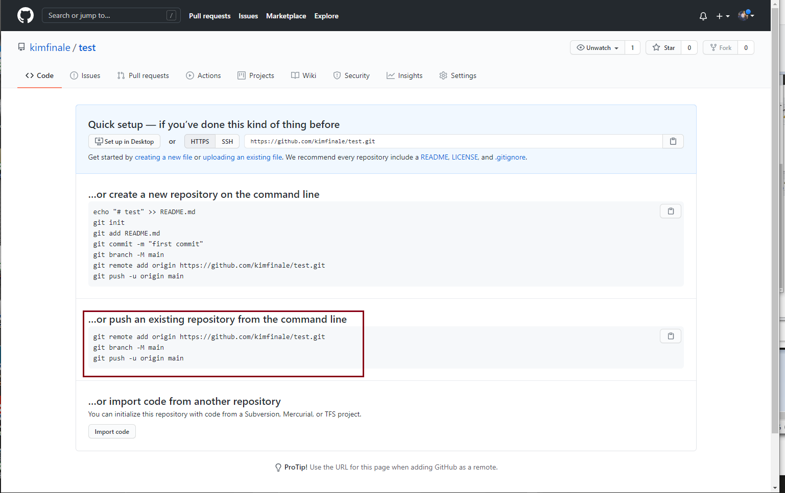
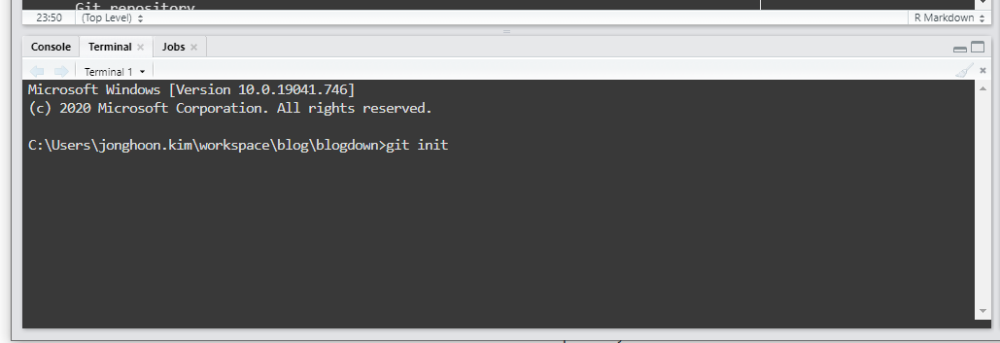

1. Create a GitHub repository. GitHub page already describes how to add an existing project to the GitHub repository. We can follow the guideline. However, we first need to initiate our local folder as a Git repository.
{width=1537px height=967px}
2. Open Git Bash. Or since I am usually on RStudio IDE and I can go to Terminal tab to execute the command.
{width=800px height=400px}
3. Initialize local directory as a Git repository. 
`git init`

4. Add files to the local repository that was just created. This stages them for the commit. 
`git add .`

5. Commit the files in the local repository. 
`git commit -m "message"`

6. Make a remote connection to the GitHub repository. 
`git remote add origin remote_repository_URL`  `remote_repository_URL` exists in the GitHub (see the image above). Now origin becomes a shortcut to the remote repository.

7.  (Optional) List the remote connections you have. 
`git remove -v`

8.  Push the changes in the local repository to the GitHub repository. 
`git push -f origin master`

